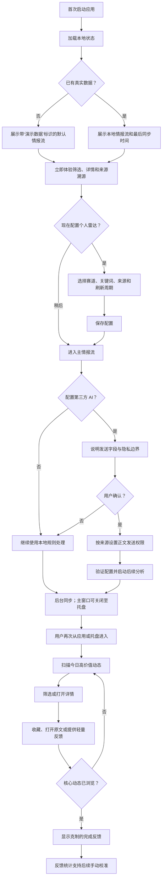
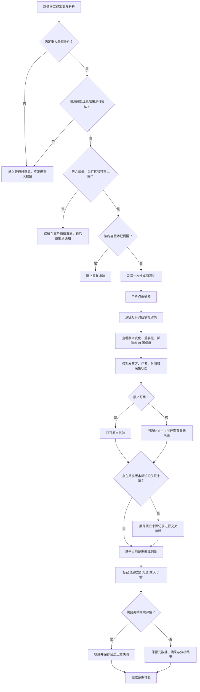
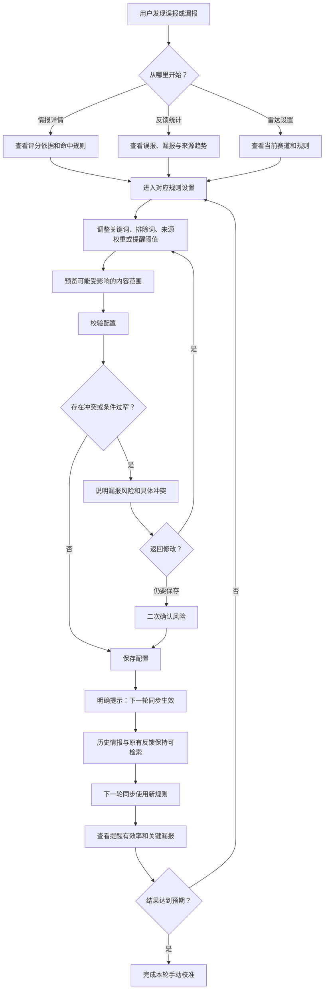
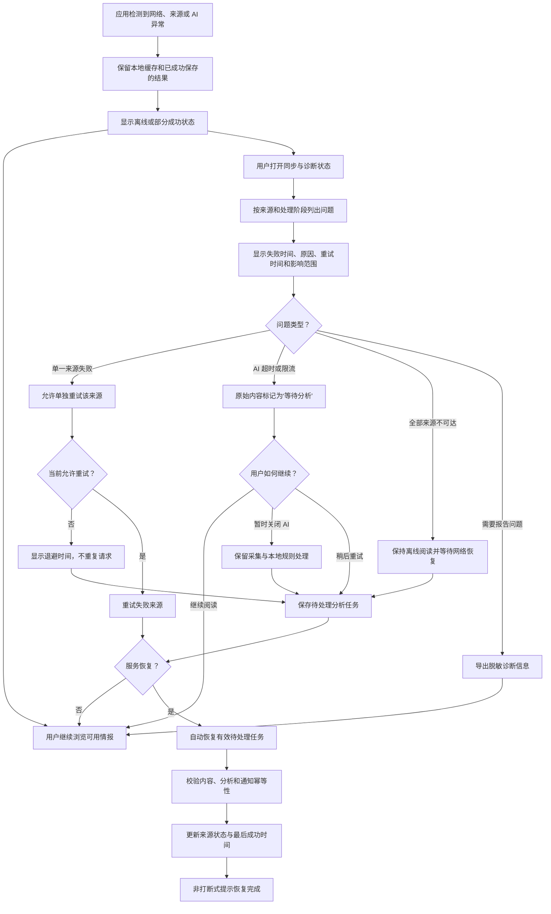

# ai-subscribe UX 设计规格

**作者：** xmy
**日期：** 2026-08-10

---

<!-- UX 设计内容将在协作工作流中按步骤追加。 -->

## 视觉设计契约

本 UX 工作流采用按平台原生的 UI 基础：Windows 使用 shadcn/ui，iOS/iPadOS 使用 SwiftUI，Android 使用 Jetpack Compose Material 3 Adaptive。三端共享产品语义、状态模型和设计令牌，但遵守各自平台的导航、控件与无障碍惯例，不追求像素级复制。

所有视觉设计决策都必须达到可实施的具体程度：

- 设计系统：Windows 使用 shadcn/ui + Tailwind/Radix；iOS/iPadOS 使用 SwiftUI；Android 使用 Jetpack Compose Material 3 Adaptive。
- 无障碍基线：Windows 支持 Radix 语义与键盘；Apple 平台支持 VoiceOver、Dynamic Type 与系统辅助功能；Android 支持 TalkBack、系统缩放与 Compose Semantics。
- 必需 UI 状态：默认、悬停、激活、禁用、加载、空、错误、成功、选中、破坏性操作和移动端状态。
- 必需产物：UX 设计规格、设计方向预览、组件/状态清单、响应式说明和视觉质量评审。
- 质量标准：清晰层级、稳定间距节奏、有目的的信息密度、克制配色、易读字体，并避免通用 AI 产品式装饰界面。

## 执行摘要

### 产品愿景

ai-subscribe 是一款面向 AI 开发者和技术负责人的跨平台本地优先情报雷达，MVP 同时覆盖 Windows、iOS/iPadOS 与 Android。它将分散的论文、项目 Release、官方博客和公开信息源转化为少量、可解释、可溯源的高价值技术动态。

UX 的首要目标是帮助用户快速完成技术判断，而不是提高内容消费量。用户应能在单条情报中理解“发生了什么、为什么重要、判断依据是什么、是否值得查看原文”，并在每天 15 分钟内完成核心浏览。

产品采用本地优先模式。无 AI Key、离线、AI 超时或单一来源故障时，核心阅读、检索、筛选、收藏和溯源能力仍然可用。

### 目标用户

**个人 AI 开发者**

- 持续关注 Agent、多模态、本地模型、推理框架和开源项目。
- 技术熟练，但没有时间每天逐个平台筛选资讯。
- 需要快速识别与当前项目直接相关的变化，并逐步校准自己的关注规则。
- 在 Windows、iPhone、iPad 与 Android 手机/平板之间使用产品，并期望各端遵守原生交互习惯。

**技术负责人**

- 关注模型能力、成本、安全、部署方式和技术选型变化。
- 需要在重大提醒出现时快速判断可信度、影响范围和是否需要进一步行动。
- 重视官方来源、发布时间、关联报道、AI 置信度及原文核验能力。
- 需要明确区分原始事实、规则判断和 AI 生成内容。

### 关键设计挑战

1. **在高信息密度与低认知负担之间取得平衡**

   情报卡需要同时呈现标题、来源、时间、重要度、摘要、影响和状态，但不能变成拥挤的元数据面板。主情报流必须支持快速扫读，次要证据按需展开。

2. **建立可见且可理解的信任边界**

   原始事实、规则评分、AI 分析和置信度必须具有稳定、非纯颜色依赖的视觉区分。用户需要知道结论来自哪里，也需要能够快速回到原文。

3. **支持复杂但不打扰的状态系统**

   产品包含离线、同步中、部分成功、等待分析、AI 失败、来源限流、原文失效和可重试等状态。状态表达既要清楚，又不能让日常信息流被系统噪声淹没。

4. **让首次体验立即有价值**

   用户无需注册或配置 AI Key 即可使用演示数据。配置赛道、来源和 AI 服务应采用渐进式引导，不能阻塞浏览。

5. **适配 Windows 常驻工作模式**

   设计需要覆盖主窗口、托盘、桌面通知、关闭隐藏、开机启动、系统恢复和键盘操作，并在不同缩放比例及深浅主题下保持稳定。

### 设计机会

1. **构建“决策卡片”而非资讯卡片**

   卡片优先回答发生了什么、为什么重要和是否需要行动；详细溯源、评分构成与关联来源按需展开。

2. **以证据层级强化可信度**

   使用清晰的信息分区和标签区分官方事实、系统规则与 AI 判断，让来源完整度和原文核验入口成为界面的核心组成部分。

3. **打造安静、紧凑、可扫描的桌面工作台**

   使用 shadcn/ui 的 Sidebar、Command、Tabs、Badge、Tooltip、Sheet、Dialog 和 Toast 等组件，形成高密度但克制的专业工具体验，避免营销页式布局和装饰性 AI 视觉。

4. **把反馈变成可见的校准闭环**

   让“有价值、无价值、重复、分析错误”等反馈轻量可达，并通过可解释统计帮助用户手动调整赛道、来源和阈值。

5. **以局部状态替代全局阻塞**

   单个来源或 AI 失败只影响对应内容与状态区域；用户仍能继续浏览缓存、搜索、收藏和处理其他来源。

## 核心用户体验

### 定义性体验

ai-subscribe 的定义性体验是“快速、可信地完成技术情报判断”。

用户进入主情报流后，应能通过标题、来源、新鲜度、重要程度和简短提炼快速扫描候选动态。对于值得关注的内容，用户进一步查看“为什么重要”、置信度、规则依据和溯源信息，再决定打开原文、收藏或提供反馈。

核心循环为：

1. 后台自动采集并整理公开信息。
2. 用户打开主情报流，优先看到少量高价值动态。
3. 用户在单张决策卡中判断相关性和影响。
4. 用户按需展开详情、关联来源和评分依据。
5. 用户打开原文核验，或收藏以便后续研究。
6. 用户通过轻量反馈校准后续结果。

如果这一循环足够快速、可信和安静，其他设置、来源管理与诊断能力才能产生价值。

### 平台策略

产品 MVP 同时面向 Windows 10/11 x64、iOS/iPadOS 与 Android 原生应用。各端共享情报、证据、规则和同步状态语义，但使用最适合平台的原生 UI 技术与导航方式。

- Windows 主窗口承担完整任务，系统托盘承担显示窗口、立即同步和显式退出等全局操作。
- iPhone 与 Android 手机使用底部主导航和堆栈详情；iPad 与 Android 平板按可用窗口空间使用两栏或三栏。
- 桌面通知与移动推送只用于满足重大动态门槛的高优先级内容，点击后直接进入对应详情。
- 后台同步不应阻塞前台浏览或要求用户持续保持主窗口打开。
- 离线、无 AI Key 或部分来源失败时，已保存内容与核心操作继续可用。
- Windows 与平板端支持键盘、鼠标或触控板；移动端核心任务支持触控与屏幕阅读器。
- Windows 适应 100%–200% 缩放；iOS/iPadOS 适应尺寸类别、Dynamic Type、安全区域和多窗口；Android 适应动态 Window Size Classes、系统缩放、折叠与多窗口。
- 通知、后台刷新和 AI 等权限采用渐进请求；拒绝权限不得阻塞浏览。

### 无负担交互

以下行为应尽量不要求用户思考：

- 启动后直接进入可浏览的主情报流，不先要求注册、登录或配置 AI。
- 自动恢复最近使用的筛选和阅读上下文，但不得恢复用户已明确关闭的系统设置。
- 卡片默认展示决策所需的最小信息，证据和次要元数据按需展开。
- 点击通知直接打开目标情报，而非通用列表。
- 收藏、反馈、打开原文和查看评分依据均应在一至两次操作内完成。
- 搜索、筛选和排序即时反馈，并允许清晰地恢复默认条件。
- 同步、AI 分析和失败恢复在后台进行；局部失败通过局部状态表达，不阻塞整个应用。
- 演示数据、原始事实、规则判断与 AI 内容始终自动带有明确标识。
- 对重复事件保留一个清晰的主判断入口，同时允许展开所有独立来源进行核验。

### 关键成功时刻

**首次价值时刻**

用户首次启动后，无需配置即可看到结构完整、明确标记为演示内容的情报流，并能打开详情、理解重要度和查看来源。

**日常成功时刻**

用户在 15 分钟内完成主情报流浏览，并确信没有必要继续逐个打开所有来源网站。

**信任建立时刻**

用户对一条高优先级情报产生疑问时，可以立即看到发布方、时间、原始标题、关联来源、规则依据、AI 标识和置信度，并顺利打开原文核验。

**差异化时刻**

用户发现系统不仅聚合了内容，还成功压低营销噪声、关联重复来源，并解释为什么某条动态值得关注。

**恢复信心时刻**

网络、AI 服务或单一来源失败时，用户仍能使用缓存，并清楚知道哪里失败、哪些数据安全、是否需要操作以及何时重试。

**体验失败条件**

- 高优先级内容无法回到可靠原文。
- AI 结论与原始事实视觉混淆。
- 单个来源失败导致主界面不可用。
- 通知频繁、重复或无法解释。
- 首次使用被注册、Key 配置或冗长向导阻塞。
- 主要判断必须经过多层页面才能完成。

### 体验原则

1. **判断优先于阅读**

   每个主界面元素都应帮助用户判断价值、影响或下一步；不为提高内容停留时间而增加噪声。

2. **证据与结论并置，但层级分明**

   原始事实、规则依据和 AI 判断应能相互参照，但必须在视觉和语义上清楚区分。

3. **默认安静，异常局部化**

   后台工作、同步状态和失败信息只在相关位置出现；重大通知必须稀少、可信且可解释。

4. **渐进呈现复杂度**

   首屏保持可扫描，详情按“核心判断 → 影响 → 证据 → 完整元数据”的层级展开。

5. **无配置即可开始，配置后持续变准**

   演示数据和默认赛道提供即时价值；用户通过反馈、来源和规则设置逐步塑造个人雷达。

6. **离线不是错误状态**

   本地缓存是正常工作模式的一部分；网络与 AI 只是增强能力，不是核心体验的单点依赖。

7. **桌面效率优先**

   Windows 支持键盘、快捷搜索、稳定焦点与托盘常驻；移动端支持触控、系统返回、原生推送深链和平台辅助技术，避免用同一布局强行覆盖全部设备。

## 期望的情绪反应

### 核心情绪目标

**首要情绪：冷静且有掌控感**

用户应感觉情报已经被整理，而不是面对另一个需要维护的资讯收件箱。产品需要降低错失重要动态的焦虑，让用户相信自己可以在有限时间内掌握关键变化。

**次要情绪：**

- **可信：** 用户清楚区分原始事实、规则判断和 AI 分析，并知道如何核验。
- **专注：** 界面帮助用户完成判断，不通过装饰、动画或无关指标争夺注意力。
- **高效：** 用户用较少操作完成浏览、核验、收藏和反馈。
- **安全：** 离线、来源失败或 AI 异常时，用户知道已有数据仍然安全。
- **逐渐熟悉：** 随着反馈和规则调整，用户感觉雷达越来越符合自己的技术方向。
- **适度满足：** 完成每日浏览后，用户得到“今天的重要变化已经掌握”的结束感。

需要避免的情绪：

- 因大量未读数和红点产生的积压焦虑。
- 因 AI 内容与事实混淆产生的怀疑。
- 因通知过多产生的疲劳和反感。
- 因故障信息模糊产生的数据丢失恐惧。
- 因复杂设置和术语堆叠产生的失控感。
- 因过度个性化而担心遗漏赛道外的重要信号。

### 情绪旅程映射

**首次启动：从好奇到放心**

用户看到明确标识的演示数据，并立即理解产品如何筛选、解释和溯源。没有注册墙或强制 Key 配置，使用户感到产品尊重其时间与选择。

**浏览主情报流：从警觉到专注**

用户最初关注是否有重要变化，随后通过清晰的信息层级快速进入扫读节奏。界面不强调未读压力，而强调已筛选内容的价值与来源。

**查看详情：从兴趣到信任**

当用户展开一条情报时，产品依次提供影响解释、置信度、规则依据和原始证据。任何 AI 判断都能追溯到事实与来源。

**完成日常任务：从判断到释然**

用户浏览完核心情报后，应获得明确但克制的完成反馈，例如“今日高价值动态已浏览”，而不是用奖励机制诱导继续消费。

**配置与校准：从不确定到胜任**

规则设置应解释调整会产生什么影响，并在条件过窄时提供风险提示。用户感到自己正在训练一套透明工具，而不是操作不可理解的推荐黑盒。

**发生故障：从担忧到恢复信心**

错误信息首先说明哪些数据仍然安全，再说明受影响的来源或任务、系统下一步动作和用户可选操作。故障不应表现为全局灾难。

**再次返回：从依赖到信赖**

用户逐渐把产品视为可靠的后台工具：它安静地工作，在真正重要时提醒，并随时允许用户检查依据。

### 微观情绪

| 场景 | 目标情绪 | 需要避免 |
|---|---|---|
| 扫描情报卡 | 清晰、专注 | 信息过载、犹豫 |
| 查看重要度 | 理解、信服 | 被算法支配 |
| 阅读 AI 提炼 | 获得帮助、保持判断力 | 把推断误认为事实 |
| 打开原文 | 顺畅、可核验 | 跳转迷失、来源不明 |
| 提供反馈 | 轻量、有影响力 | 像填写调查问卷 |
| 收到通知 | 值得关注 | 被打扰、被操纵 |
| 离线使用 | 连续、安全 | 产品失效感 |
| 同步失败 | 知情、可恢复 | 数据丢失恐惧 |
| 调整规则 | 胜任、可预期 | 黑盒感、配置焦虑 |
| 完成每日浏览 | 释然、掌握全局 | 未读积压压力 |

### 设计含义

**为了营造冷静感：**

- 使用克制、中性的基础色和有限的语义强调色。
- 不将未读数量设计为惩罚性红色徽标。
- 避免持续脉冲、闪烁和无意义动效。
- 主情报流采用稳定节奏和明确留白，而非嵌套卡片墙。

**为了建立信任：**

- 来源、原文和发布时间始终容易找到。
- AI 内容使用文字、图标或边界样式标识，不只依赖颜色。
- 置信度避免伪精确表达；同时说明影响判断的主要因素。
- 错误状态明确说明数据安全状态和恢复动作。
- 用户可查看被过滤内容及原因。

**为了增强掌控感：**

- 搜索、筛选、排序和同步状态保持可见且可撤销。
- 免打扰、通知频率、AI 发送范围和开机启动由用户明确控制。
- 系统自动行为需可解释，并提供查看历史或当前状态的入口。
- 设置保存后说明何时生效，不让用户猜测。

**为了形成完成感：**

- 提供轻量的浏览进度或“今日重点已处理”状态，但不制造连续签到压力。
- 将未处理的高优先级内容与普通候选区分，而不是把所有内容都视为待办。
- 完成状态不隐藏被过滤内容和赛道外探索入口。

**为了增加适度愉悦：**

- 愉悦来自速度、准确和细节，而不是装饰。
- 快捷键、通知深链、原文跳转和筛选恢复等交互应具有即时反馈。
- 当系统成功关联多个可靠来源时，可用克制的证据聚合表达强化“雷达发现了模式”的价值感。

### 情绪设计原则

1. **消除错失焦虑，不制造未读焦虑。**
2. **用证据建立信任，不用品牌语气要求信任。**
3. **错误首先保护用户信心，再提供技术细节。**
4. **让自动化保持安静，让控制始终可见。**
5. **完成比沉浸更重要；产品帮助用户离开，而不是延长停留。**
6. **愉悦来自判断更快、来源更清楚和恢复更可靠。**
7. **任何紧迫感都必须来自情报本身，而不是界面装饰。**

## UX 模式分析与灵感

### 参考产品分析

#### Linear：高密度但可控的操作工作台

可借鉴：

- 稳定的左侧导航与高密度列表，使用户快速切换视图而不丢失上下文。
- J/K 或方向键式列表导航，让高频浏览不依赖鼠标。
- 当前视图搜索与全局命令入口分离：一个用于缩小当前结果，一个用于跨模块导航。
- 可保存的筛选视图，使频繁使用的条件成为稳定入口。
- 选中列表项后在同一上下文中查看和处理详情，减少页面跳转。

需要调整：

- ai-subscribe 不应把所有情报都塑造成必须清空的 Inbox。
- 不直接复制任务管理语义；普通候选内容不应给用户造成待办压力。
- 快捷操作只暴露高频动作，避免形成需要背诵的命令体系。

#### Readwise Reader：自动信息流与主动知识库分离

可借鉴：

- 将自动进入的 Feed 与用户主动保存的 Library 分开，清楚表达“系统发现”和“用户选择保留”的差异。
- 使用 Later、Shortlist、Archive 等简单状态支持内容分流。
- 命令面板与键盘驱动提高桌面端处理效率。
- 允许用户保存动态筛选视图，而不是仅依赖固定文件夹。

需要调整：

- ai-subscribe 的主要目标是判断技术影响，而不是深度阅读与批注。
- MVP 不需要复制复杂的文档类型、标注系统或高度可配置的知识库结构。
- 收藏必须同时表达正文快照、离线可用和内容生命周期边界。

#### Feedly：规则驱动的情报降噪

可借鉴：

- 用户可创建、暂停、恢复和删除过滤规则。
- 过滤管理界面能展示规则是否生效以及过滤了多少内容。
- 用户可查看被规则移除的内容，从而审查误过滤。
- AI 筛选流与普通 RSS 流具有概念区分，避免混淆处理方式。
- 来源、主题和规则共同构成长期信息组织方式。

需要调整：

- ai-subscribe 应将“为什么进入或未进入主情报流”直接放到单条情报的解释中，而不只放在独立规则后台。
- 筛选逻辑必须区分本地规则和 AI 判断。
- 用户反馈只用于手动校准，Phase 1 不自动改变权重。

### 可迁移的 UX 模式

#### 导航模式

**稳定左侧导航**

一级入口建议保持稳定：

- 主情报流
- 探索与被过滤内容
- 收藏
- 来源
- 雷达规则
- 同步与诊断
- 设置

高优先级状态通过克制的数量或状态提示表达，不使用持续红色未读压力。

**列表—详情双栏**

主情报流采用可调宽度的列表—详情布局：

- 左侧或中部列表用于快速扫描。
- 右侧详情用于解释影响、展示证据和执行操作。
- 用户可将详情展开为专注阅读模式。
- 选中项、滚动位置和筛选条件在返回时保持。

**当前视图搜索与全局命令分离**

- `/` 或 `Ctrl+F`：筛选当前情报列表。
- `Ctrl+K`：打开全局命令面板，用于导航、同步、切换视图和执行高频操作。
- 搜索状态必须明确显示作用范围。

**保存视图**

用户可以把赛道、来源、时间和重要度组合保存为个人视图，例如“本地模型官方更新”或“过去七天高优先级论文”。

#### 交互模式

**连续键盘浏览**

- `J/K` 或方向键移动列表选择。
- `Enter` 打开或聚焦详情。
- `O` 打开原文。
- `S` 收藏或取消收藏。
- `F` 打开反馈菜单。
- `Esc` 关闭浮层、清除临时搜索或返回上一层。

所有快捷键同时提供可发现的菜单入口与 Tooltip，不要求用户记忆。

**渐进式详情**

详情按以下顺序展开：

1. 发生了什么。
2. 为什么重要。
3. 可能影响。
4. AI 置信度与处理状态。
5. 规则判断依据。
6. 原始事实与完整溯源。
7. 关联来源。
8. 内容生命周期与诊断信息。

**可逆反馈**

反馈操作应即时生效并可撤销。反馈完成后不自动把用户带离当前内容，也不弹出长表单。

**可审计过滤**

被过滤内容保留独立入口，用户可看到：

- 命中的过滤规则。
- 未达到的阈值。
- 来源权重和溯源门控结果。
- 是否存在 AI 判断。
- 调整对应规则的入口。

**Feed 与收藏分离**

- 主情报流表示系统认为值得关注的当前信号。
- 收藏表示用户主动选择长期保留和离线阅读的研究材料。
- 收藏不等同于“已读”，主情报流也不等同于必须清空的收件箱。

#### 视觉模式

- 使用单一主表面与少量分隔线，不堆叠多层卡片。
- 通过字号、字重、间距和对齐建立层级，再使用颜色辅助。
- 来源、AI、规则、离线和错误状态同时使用文字与图标。
- 重要程度使用有限级别和稳定位置，不以大面积红色制造紧迫感。
- 详情中的原始事实与 AI 分析使用不同区块语义，但保持同一视觉系统。
- 列表行支持紧凑、标准两种密度，不提供过多自定义选项。

### 需要避免的反模式

1. **所有内容都进入待处理 Inbox**

   这会把情报浏览变成债务管理，违背“少而准”和降低焦虑的目标。

2. **只用颜色表示来源、AI 或状态**

   会损害无障碍，也容易让事实与推断发生混淆。

3. **用神秘分数代替解释**

   单独展示“92 分”或“高置信”不足以建立信任；必须同时展示影响因素和证据。

4. **把筛选配置藏进多层设置**

   用户应能从单条情报或被过滤记录直接理解并调整相关规则。

5. **嵌套卡片和仪表盘堆叠**

   每个区域都使用 Card 会削弱层级、浪费桌面空间，并产生通用 AI 产品外观。

6. **过度依赖未读红点和实时动画**

   产品不是社交媒体；高优先级必须由内容本身和明确语义表达。

7. **全局错误遮罩**

   单个来源或 AI 失败不得覆盖整个主界面或阻断缓存浏览。

8. **自动学习但不可撤销**

   Phase 1 中反馈不得静默修改规则；所有校准都应由用户确认。

9. **把长摘要当作核心价值**

   卡片首先支持判断；完整正文和长分析按需展开。

### 设计灵感策略

**直接采用：**

- Linear 式稳定侧栏、高密度列表、键盘导航和命令入口。
- Readwise Reader 式自动信息流与主动收藏区分。
- Feedly 式可暂停、可审查、可恢复的过滤规则。
- 可保存筛选视图和当前上下文搜索。

**结合产品目标改造：**

- 将任务列表改造成决策流，不要求清空普通候选内容。
- 将阅读状态改造成“已判断、待研究、已收藏”等更符合技术情报的状态。
- 将 AI 筛选从黑盒推荐改造成事实、规则和 AI 三层解释。
- 将详情侧栏改造成“决策证据面板”，而不是文章预览器。

**明确避免：**

- 通用 RSS 阅读器式的海量未读列表。
- 社交产品式通知和注意力争夺。
- 只有摘要、没有证据的 AI 卡片。
- 复杂知识库式分类体系抢占 MVP 核心。
- 将桌面高密度三栏直接缩小到手机，或将手机大卡片布局机械放大到桌面和平板。

## 设计系统基础

### 1.1 设计系统选择

项目采用三套平台原生 UI 基础：

- Windows：**shadcn/ui + Tailwind CSS 语义令牌 + Radix 交互原语**。
- iOS/iPadOS：**SwiftUI + Apple 原生导航、表单、列表与辅助功能语义**。
- Android：**Jetpack Compose + Material 3 Adaptive + Compose Semantics**。

三端共享领域组件契约、状态枚举、内容层级和语义令牌映射，但各自使用平台原生组件渲染。Windows 不混用 Ant Design、MUI 等完整组件系统；移动端不套用 shadcn/ui 的 DOM/CSS 结构，也不追求跨平台像素一致。

### 选择理由

- Windows 的 React + TypeScript/Tauri 技术与 shadcn/ui、Tailwind 和 Radix 匹配，适合高密度桌面工作区。
- SwiftUI 能原生处理 iPhone/iPad 尺寸类别、NavigationSplitView、Dynamic Type、VoiceOver 和系统外观。
- Jetpack Compose Material 3 Adaptive 能基于动态 Window Size Classes 处理手机、平板、折叠屏和多窗口。
- 平台原生控件能正确继承系统返回、手势、键盘、指针、权限和辅助技术行为。
- 共享语义令牌保证品牌、状态与证据层级一致；平台映射保证控件仍符合本地习惯。
- 专项图表、虚拟列表或富文本能力必须通过平台项目组件层接入。

### Windows：shadcn/ui 组件基线

#### 导航与工作区

| 组件 | 用途 | 依赖流程 |
|---|---|---|
| `Sidebar` | 主情报流、探索、收藏、来源、规则、诊断和设置 | 全局导航 |
| `Resizable` | 列表与详情之间的可调分栏 | 浏览与详情 |
| `Scroll Area` | 独立控制导航、列表和详情滚动区域 | 高频浏览 |
| `Separator` | 使用轻量边界建立区域层级 | 全局 |
| `Tabs` | 详情中的概览、证据、关联来源等同层切换 | 情报核验 |
| `Breadcrumb` | 设置、来源和诊断等深层管理页面定位 | 管理流程 |
| `Command` | 全局导航、同步、切换视图和高频操作 | 键盘效率 |
| `Sheet` | 窄窗口中的详情、筛选或辅助面板 | 自适应布局 |

#### 搜索、筛选与设置

| 组件 | 用途 | 依赖流程 |
|---|---|---|
| `Input` | 当前视图搜索、关键词和来源地址 | 搜索与配置 |
| `Select` | 排序、来源类型、时间范围和重要度 | 筛选 |
| `Popover` | 组合筛选、日期与轻量配置 | 主情报流 |
| `Checkbox` | 多选来源、赛道和处理状态 | 筛选与配置 |
| `Switch` | 启用来源、AI、开机启动和免打扰 | 设置 |
| `Slider` | 提醒阈值、来源权重等连续值 | 雷达规则 |
| `Form` | 统一验证来源、AI 服务和规则设置 | 配置流程 |
| `Radio Group` | 互斥处理策略和显示密度 | 设置 |
| `Collapsible` | 渐进展示高级设置和诊断信息 | 设置与详情 |

#### 数据与状态

| 组件 | 用途 | 依赖流程 |
|---|---|---|
| `Badge` | 来源、AI 状态、重要度、离线和处理状态 | 情报卡与详情 |
| `Table` / `Data Table` | 来源管理、同步历史、规则统计和诊断 | 管理页面 |
| `Progress` | 有明确总量的同步或迁移进度 | 系统状态 |
| `Skeleton` | 首次载入与详情切换 | 加载状态 |
| `Tooltip` | 快捷键、截断字段和图标解释 | 全局 |
| `Alert` | 页面级但非阻塞的离线、部分成功和配置风险 | 状态提示 |
| `Chart` | 四周验证指标与反馈趋势 | 校准统计 |

主情报流不直接使用 `Data Table`。它需要专用的语义列表项，以支持标题换行、摘要、来源、状态和连续键盘选择。

#### 操作与反馈

| 组件 | 用途 | 依赖流程 |
|---|---|---|
| `Button` | 主要、次要、图标和破坏性动作 | 全局 |
| `Dropdown Menu` | 单条情报、来源和规则的次要操作 | 上下文操作 |
| `Context Menu` | 桌面端右键快捷操作 | 高频处理 |
| `Dialog` | 需要用户集中确认的配置或授权 | AI 授权 |
| `Alert Dialog` | 删除正文、清空索引等不可逆操作 | 内容生命周期 |
| `Sonner` | 保存、复制、撤销和后台操作结果 | 即时反馈 |
| `Popover` | 反馈菜单和评分依据摘要 | 轻量操作 |
| `Hover Card` | 来源摘要等非关键补充信息 | 辅助信息 |

### iOS/iPadOS：SwiftUI 组件基线

| 产品模式 | SwiftUI 基础 | 适配说明 |
|---|---|---|
| 主导航 | `TabView`、`NavigationStack`、`NavigationSplitView` | iPhone 单栈；iPad 按尺寸类别显示两栏或三栏 |
| 情报列表 | `List`、`ScrollView`、`LazyVStack` | 支持选择、刷新、搜索与 Dynamic Type |
| 详情与证据 | `Section`、`DisclosureGroup`、`LabeledContent` | 渐进展示 AI、依据与溯源 |
| 筛选与规则 | `Form`、`Picker`、`Toggle`、`Slider`、`.sheet` | 遵守系统表单和呈现习惯 |
| 状态与确认 | `ProgressView`、`ContentUnavailableView`、`Alert`、`ConfirmationDialog` | 加载、空、错误和风险确认 |
| 平台能力 | `.searchable`、`.refreshable`、`ShareLink`、`openURL` | 原生搜索、刷新、分享和原文打开 |

### Android：Jetpack Compose 组件基线

| 产品模式 | Compose 基础 | 适配说明 |
|---|---|---|
| 主导航 | Material 3 Navigation Bar/Rail/Drawer、Navigation Compose | 随 Window Size Class 改变导航形态 |
| 情报列表 | `LazyColumn`、Material 3 `ListItem`、Pull to Refresh | 支持大列表、选择与刷新 |
| 详情与证据 | Material 3 Adaptive 多窗格、`Scaffold`、展开区域 | 手机单栈，平板与折叠屏列表—详情并列 |
| 筛选与规则 | `TextField`、`DropdownMenu`、`Switch`、`Slider`、Bottom Sheet | 触控优先并支持键鼠 |
| 状态与确认 | Snackbar、Progress Indicator、Dialog、空状态组合 | 局部反馈与风险确认 |
| 平台能力 | Deep Link、Share Intent、系统 Back、Window Insets | 推送深链、分享、安全区域和预测性返回 |

### 共享领域组件契约

`IntelligenceFeedItem`、`EvidenceDetailPanel`、`SourceProvenanceGroup`、`SyncHealthSummary`、`RuleImpactPreview` 与 `ProgressiveSetupGuide` 是跨平台产品语义，而不是共享视图代码。每个平台实现相同的数据字段、状态和无障碍名称，并映射到本平台组件。

### 令牌与主题策略

#### 色彩令牌

色彩以中性灰为主体，青绿色作为主要交互强调。红色只用于真实错误和破坏性操作，不用于一般未读或高优先级状态。

建议初始 OKLCH 令牌：

| 令牌 | 浅色主题 | 深色主题 | 用途 |
|---|---|---|---|
| `background` | `oklch(0.985 0.004 240)` | `oklch(0.155 0.008 240)` | 应用主背景 |
| `foreground` | `oklch(0.190 0.012 240)` | `oklch(0.940 0.008 240)` | 主文本 |
| `card` | `oklch(1 0 0)` | `oklch(0.190 0.010 240)` | 独立浮层和详情区 |
| `muted` | `oklch(0.955 0.006 240)` | `oklch(0.245 0.010 240)` | 次级表面 |
| `muted-foreground` | `oklch(0.470 0.015 240)` | `oklch(0.700 0.014 240)` | 次要文本 |
| `primary` | `oklch(0.500 0.105 188)` | `oklch(0.700 0.115 188)` | 主操作、焦点与选中 |
| `primary-foreground` | `oklch(0.985 0.004 188)` | `oklch(0.160 0.020 188)` | 主色上的文本 |
| `accent` | `oklch(0.930 0.030 188)` | `oklch(0.270 0.045 188)` | 悬停和轻量强调 |
| `border` | `oklch(0.890 0.008 240)` | `oklch(0.310 0.010 240)` | 区域和控件边界 |
| `ring` | `oklch(0.560 0.120 188)` | `oklch(0.720 0.120 188)` | 键盘焦点 |
| `destructive` | `oklch(0.570 0.220 27)` | `oklch(0.650 0.200 27)` | 错误与破坏性操作 |

额外业务语义令牌：

- `signal-critical`：真正满足重大动态标准的内容。
- `signal-high`：高价值但不一定需要立即通知。
- `signal-normal`：普通候选。
- `source-official`：官方或一手来源。
- `ai-generated`：AI 生成内容的辅助边界。
- `status-offline`：离线但可继续使用。
- `status-warning`：部分成功、限流或等待恢复。
- `status-success`：同步、保存和恢复成功。

所有业务状态必须同时具有文字或图标，颜色只作为辅助。

#### 字体

- UI 主字体：`"Segoe UI Variable", "Segoe UI", system-ui, sans-serif`
- 技术字段：`ui-monospace, "Cascadia Code", Consolas, monospace`
- 基础字号：14px
- 辅助元数据：12px，行高 18px
- 正文：14px，行高 21px
- 情报标题：15px，行高 22px，字重 600
- 页面标题：20px，行高 28px，字重 650
- 详情主标题：24px，行高 32px，字重 650

禁止使用全大写英文作为主要层级方式；中文界面通过字重、间距和边界建立层级。

#### 圆角

- `--radius: 6px`
- 小控件、Badge：4px
- 输入框、按钮和列表选中背景：6px
- Dialog、Popover、Sheet：8px
- 不使用大于 12px 的通用圆角，不形成消费型“大胶囊”界面。

#### 间距与密度

采用 4px 基础网格和“紧凑但可读”的默认密度：

- 图标按钮：28×28px
- 紧凑按钮与输入：32px 高
- 标准表单控件：36px 高
- 列表项纵向内边距：8–10px
- 面板内边距：12–16px
- 页面区块间距：20–24px
- 桌面主侧栏：220–248px
- 情报列表理想宽度：380–520px
- 详情面板最小宽度：440px

紧凑模式不得把核心点击目标压缩至 28px 以下；需要触控兼容的场景使用至少 36px。

#### 边界、阴影与层级

- 默认使用 1px 边界和背景差异分隔区域。
- 固定面板、列表行和详情正文不使用阴影。
- 阴影只用于 Dialog、Popover、Command 和拖动中的浮层。
- 列表选中状态使用 `accent` 背景、左侧 2px 主色指示和明确的 `aria-selected`。
- 悬停不得覆盖选中状态。
- 破坏性操作只在确认步骤使用红色强调。

#### 焦点与交互状态

- 键盘焦点：2px `ring` 外环，偏移 2px。
- 悬停：轻量 `accent` 背景或边界变化。
- 按下：背景明度降低一级，并提供即时触觉式视觉反馈。
- 禁用：降低对比度但保持文字可读，同时禁止 Tooltip 之外的暗示性操作。
- 加载：保留布局尺寸，使用 Skeleton 或局部旋转指示，不清空现有内容。
- 选中：背景、边界和 `aria-selected` 三重表达。
- 错误：图标、标题、影响范围和恢复动作共同出现。
- 成功：使用克制的 Sonner 提示，不制造大面积绿色庆祝界面。

### 实施方式

1. Windows 使用 shadcn/ui CLI 纳入组件源码；iOS 使用 SwiftUI 原生组件；Android 使用 Compose Material 3/Adaptive。
2. 建立平台无关的领域状态、内容字段、事件和设计令牌契约，再分别映射到 Tailwind、SwiftUI Environment/Assets 与 Compose Theme。
3. 各平台建立本地组合组件，不在页面中重复拼接原语：
   - `AppSidebar`
   - `WorkspaceHeader`
   - `IntelList`
   - `IntelListItem`
   - `IntelDetailPanel`
   - `EvidenceSection`
   - `SourceIdentity`
   - `AnalysisDisclosure`
   - `ConfidenceIndicator`
   - `FilterBar`
   - `SavedViewMenu`
   - `SyncStatus`
   - `FeedbackMenu`
   - `RecoverableError`
4. Windows 覆盖层使用 Radix 焦点规则；iOS 与 Android 使用系统原生呈现、返回和焦点行为。
5. 列表状态由共享语义属性驱动，不在组件内部根据颜色推断业务状态。
6. 大列表采用平台虚拟化能力，并保持焦点、选中项和可访问名称稳定。
7. 三端共享领域测试向量与视觉状态清单；视图代码按平台独立实现。

### 定制策略

**应直接使用或轻度封装：**

- Button、Input、Checkbox、Switch、Separator、Tooltip、Skeleton。
- Dialog、Alert Dialog、Popover 和 Dropdown Menu 的基础交互。

**需要项目级封装：**

- Sidebar：加入当前同步状态、保存视图和紧凑模式。
- Command：加入全局导航、情报定位、同步和快捷动作分类。
- Badge：建立来源、AI、重要度和运行状态的独立变体。
- Resizable：保存面板宽度并处理缩放后的最小尺寸。
- Data Table：统一列密度、键盘操作、空状态和错误状态。

**需要专用组合组件：**

- 情报列表项、决策证据面板、来源关联组、AI 说明区和可恢复错误。
- 这些组件不应被简化为通用 Card 的层层嵌套。

**组件完成标准：**

每个项目级组件必须定义默认、悬停、焦点、按下、选中、禁用、加载、空、错误和破坏性状态；同时提供浅色、深色、100%–200% 缩放及键盘操作验证。

## 2. 核心用户体验

### 2.1 定义性体验

ai-subscribe 的定义性体验是：

**从一条技术信号，快速形成一个可核验的关注决定。**

用户不需要完整阅读每篇文章，也不需要理解系统全部评分逻辑。主情报流中的每个列表项和详情面板共同回答四个连续问题：

1. **发生了什么？**
2. **为什么可能重要？**
3. **这个判断依据什么？**
4. **我现在需要做什么？**

用户可以在数秒内完成“忽略、稍后研究、立即关注或核验原文”的判断。任何高优先级结论都允许用户继续检查来源、规则依据、AI 置信度和关联报道。

产品被用户描述时，应接近：

> “它把 AI 技术动态先替我筛一遍，但不会把判断藏起来。我扫几条重点，就知道今天有没有值得关注的变化。”

### 2.2 用户心智模型

#### 用户当前的解决方式

目标用户通常在以下模式之间来回切换：

- 打开多个官方博客、GitHub、arXiv、社区和媒体页面。
- 使用 RSS 阅读器收集内容，但仍需自己处理海量未读。
- 在群聊、社交媒体或邮件中被动发现动态。
- 手动比较多个来源，判断是否为重复报道。
- 把可能有价值的链接保存到浏览器书签、笔记或稍后阅读工具。
- 根据标题、来源信誉和经验快速决定是否深入阅读。

他们已经熟悉“信息流、筛选器、搜索、收藏和详情”这些模式，因此产品不需要教育用户学习全新导航。

#### 用户带入产品的预期

- 新内容应按时间和重要性有序出现。
- 官方来源比转载更可信。
- 标题、来源和发布时间应始终可见。
- 收藏意味着主动保留，而不是简单的“已读”。
- 搜索和筛选应即时生效。
- 通知只用于真正需要立即知道的内容。
- 点击一条内容应直接看到详情，而不是丢失当前列表上下文。
- AI 可以协助提炼，但不能取代来源证据。

#### 容易发生的认知混淆

- 把“高重要度”误认为“AI 高置信度”。
- 把规则判断误认为原文事实。
- 把多个关联来源误认为内容已被删除或合并。
- 把未进入主情报流理解为内容被永久删除。
- 把收藏、已查看和反馈状态混为一谈。
- 把离线状态误认为数据库或同步结果丢失。
- 把局部来源失败理解为整轮同步失败。
- 不确定规则修改是立即影响历史数据，还是从下一轮同步生效。

界面必须通过稳定术语、空间分区和明确状态说明消除这些混淆。

### 2.3 成功标准

#### 单条情报判断

- 用户在列表项中即可看清标题、来源、发布时间、主题、重要程度和处理状态。
- 用户在打开详情后的首个视口内看到“发生了什么”“为什么重要”和主要操作。
- 用户无需离开详情即可知道内容来自原始事实、规则还是 AI。
- 用户最多两次操作即可打开原文、收藏或提供反馈。
- 高优先级内容始终可找到有效来源和核验入口。

#### 连续浏览

- 用户可通过鼠标或键盘连续切换条目，详情随选择更新。
- 切换条目时保持列表滚动位置、筛选和面板宽度。
- 详情加载不清空列表，也不阻塞下一个选择。
- 用户能清楚区分未查看、已判断、已收藏和待研究状态。
- 一次日常浏览可在 15 分钟内完成。

#### 信任与解释

- 每个 AI 字段均有可见标识。
- 重要程度与置信度使用不同视觉与术语。
- 评分依据可从详情首层进入，不隐藏在设置页。
- 关联来源保留各自标题、链接、时间和发布方。
- 被过滤内容可以审查并显示具体原因。

#### 系统连续性

- 离线或局部失败时，当前内容不消失。
- 错误提示说明影响范围、数据安全状态和恢复动作。
- 后台同步与 AI 分析不会打断当前浏览。
- 用户操作获得即时反馈，并在失败时保留输入与上下文。

#### 感知性能目标

- 列表选择后的视觉响应应接近即时。
- 搜索和常用筛选在用户感知上不出现等待页。
- 加载状态保持原布局，不发生明显跳动。
- 后台处理只更新相关状态，不触发整个工作区刷新。

### 2.4 新颖 UX 模式

核心体验主要使用成熟模式，但通过以下组合形成产品差异：

#### 决策卡片

它不是普通文章卡片，也不是任务卡片。它把内容摘要、影响判断、来源身份和处理状态组织成快速决策入口。

创新点：

- 重要程度与来源可靠性同时可见。
- AI 结论具有明确边界。
- 每条内容包含直接反馈入口。
- 卡片本身不承载全部证据，避免过载。

#### 决策证据面板

详情不是文章阅读器，而是分层证据面板：

1. 结论摘要。
2. 影响与可能行动。
3. AI 置信度。
4. 规则判断因素。
5. 原始事实。
6. 来源链与关联报道。
7. 正文快照和生命周期状态。

这是一种熟悉的列表—详情模式，但详情结构围绕“判断可信度”而不是“内容消费”。

#### 可审计主情报流

用户不仅能看到进入主流的内容，也能查看被过滤内容和原因。筛选结果不是不可逆的黑盒。

#### 局部可信状态

同步、AI 和来源状态附着在受影响对象上。全局只显示简短汇总，具体问题在对应来源、任务或情报处解释。

#### 使用方式教育

无需独立教学流程。产品通过以下熟悉线索逐步说明新模式：

- 首次演示数据中的简短标注。
- AI 与规则区域的内联说明。
- Tooltip 中的术语解释。
- 首次打开评分依据时的一次性提示。
- 命令面板中的可发现快捷键。
- 被过滤内容页中的筛选原因示例。

### 2.5 体验机制

#### 1. 启动

**触发方式：**

- 用户打开应用。
- 点击桌面通知。
- 从托盘选择“显示主窗口”。
- 使用系统启动后后台常驻，再主动打开窗口。

**系统行为：**

- 普通启动恢复上次主视图、筛选、选中项和面板宽度。
- 通知启动直接定位目标详情，同时保留可返回的来源视图。
- 首次启动显示演示数据和轻量说明，不打开阻塞式向导。
- 离线启动直接加载缓存，并在工作区顶部显示非阻塞状态。

#### 2. 扫描

**布局：**

- 左侧为稳定导航。
- 中间为主情报列表。
- 右侧为选中条目的决策证据面板。
- 顶部工具栏包含当前视图名称、搜索、筛选、排序与同步状态。

**列表项优先级：**

1. 标题。
2. 发布方与来源类型。
3. 发布时间和新鲜度。
4. 一行“为什么值得关注”。
5. 主题与重要度。
6. AI、离线、等待分析等状态。
7. 收藏和反馈等快捷操作仅在悬停、选中或键盘聚焦时完整显示。

**交互：**

- 单击或 `J/K` 选择条目。
- `Enter` 将焦点移入详情。
- 双击不承担独有功能，避免可发现性问题。
- 选中项具有背景、左侧标记和可访问状态三重表达。

#### 3. 判断

详情首屏按照固定顺序展示：

- 标题与来源身份。
- “发生了什么”。
- “为什么重要”。
- 可能影响。
- 重要程度和 AI 置信度。
- 打开原文、收藏和反馈操作。

用户可展开“判断依据”，查看规则因素、AI 说明和溯源字段。重要度表示内容影响，置信度表示 AI 判断把握，两者不得合并为一个分数。

#### 4. 核验

- 点击“查看原文”使用系统默认浏览器打开。
- 原文跳转前无需二次确认，除非链接状态异常或目标不安全。
- 关联来源在详情内按发布方和时间排列。
- 每个来源保持独立标题、链接、时间和可用状态。
- 原文失效时保留采集时元数据，并明确说明收藏快照是否存在。

#### 5. 处理

用户可以：

- 收藏并保存合法正文快照。
- 标记为“值得立即知道”“有价值但不紧急”“无价值”“重复”或“分析错误”。
- 将内容加入待研究状态。
- 查看同类或同来源情报。
- 从过滤原因进入相关规则。
- 对失败的 AI 分析发起重试。

所有轻量操作即时反馈并支持撤销；删除正文等不可逆操作使用 Alert Dialog。

#### 6. 连续浏览

完成操作后：

- 默认保持当前条目，不自动跳转，避免用户失去上下文。
- 用户可启用“操作后选择下一条”的个人偏好，但不作为默认。
- `J/K` 继续移动，右侧详情保持当前滚动位置策略明确：切换条目后回到详情顶部。
- 已提供反馈的条目获得轻量状态标识，不从列表中突然消失。
- 如果当前筛选会排除刚处理的条目，先保留至用户离开或刷新视图，并提示状态变化。

#### 7. 完成

系统不要求清空全部内容。完成条件是：

- 当日高优先级内容已被查看或明确处理。
- 用户主动结束浏览。
- 当前视图没有仍需立即关注的内容。

界面提供克制的完成状态：

- “今日重点已浏览”
- 最近一次同步时间
- 下一次计划同步时间
- 普通候选和探索入口

不使用连续签到、奖励动画或惩罚性未读统计。

#### 8. 异常与恢复

- 单源失败：只在同步汇总和对应来源显示。
- AI 失败：保留原始内容，显示“等待分析”或“可重试”。
- 离线：继续浏览缓存，暂停外部操作。
- 原文失效：保留溯源元数据并标明链接状态。
- 保存失败：保留用户输入和当前上下文，提供重试。
- 数据完整性异常：阻止受影响写入，说明已有数据状态和恢复步骤。

## 视觉设计基础

### 色彩系统

采用“中性工作台 + 信号青主色 + 严格语义状态色”的方案。

**主题选择：信号青**

- 中性灰承担绝大多数表面、文本和边界。
- 青绿色只用于主要操作、选中状态、键盘焦点和可信交互。
- 高优先级情报使用克制的暖色文字与边界，不使用大面积红色背景。
- 红色仅表示真实错误、数据风险或破坏性操作。
- 黄色用于限流、部分成功和需要关注但不危险的状态。
- 绿色用于同步成功、数据安全和恢复完成。
- AI 生成内容使用主色的低饱和变体，并始终配合文字或图标。

shadcn/ui 语义令牌采用设计系统章节定义的 OKLCH 值，并增加：

- `signal-critical`
- `signal-high`
- `signal-normal`
- `source-official`
- `ai-generated`
- `status-offline`
- `status-warning`
- `status-success`

浅色和深色主题必须使用相同语义映射，不允许在深色模式中改变状态含义。

**候选方向用途：**

- “研究墨蓝”保留为未来编辑阅读模式的备选视觉方向。
- “雷达琥珀”仅可用于少量品牌识别或重大信号点缀，不作为主主题。
- 第一版只实施信号青的浅色与深色主题，避免维护多套品牌皮肤。

### 字体系统

各平台采用原生系统字体并共享字号语义，不打包一套字体强制覆盖三端：

- Windows：`"Segoe UI Variable", "Segoe UI", system-ui, sans-serif`
- iOS/iPadOS：SwiftUI 系统字体与 Dynamic Type 文本样式。
- Android：Compose Material 3 系统字体与可缩放 `sp` 文本样式。
- 技术字段：`ui-monospace, "Cascadia Code", Consolas, monospace`

字号体系：

| 角色 | 字号/行高 | 字重 | 用途 |
|---|---|---|---|
| Display | 28/36px | 650 | 极少使用的空状态或完成状态标题 |
| H1 | 24/32px | 650 | 情报详情主标题 |
| H2 | 20/28px | 650 | 页面标题 |
| H3 | 16/24px | 650 | 主要区块标题 |
| Title | 15/22px | 600 | 情报列表标题 |
| Body | 14/21px | 400 | 摘要、说明和详情正文 |
| Label | 13/18px | 600 | 表单、区块和操作标签 |
| Meta | 12/18px | 400–600 | 来源、时间、状态与辅助数据 |
| Code | 12/18px | 400 | 内容标识、URL、错误码和技术字段 |

规则：

- 主情报列表默认最多显示两行标题与两行提炼。
- 详情正文最大阅读宽度约 72 个中文字符。
- 关键元数据不得使用低于 12px 的字号。
- 不依赖全大写、斜体或极细字重表达层级。
- 中英文混排以中文基线和行高为准。

### 间距与布局基础

采用 4px 基础网格和紧凑桌面密度。

**应用框架：**

- 主侧栏：220–248px，可折叠为 56px 图标栏。
- 情报列表：380–520px，可通过 Resizable 调整。
- 详情面板：最小 440px，正文内容最大 780px。
- 最小支持窗口：1024×700。
- 推荐工作窗口：1280×800 及以上。
- 低于三栏最小宽度时，详情改为 Sheet 或独立详情视图。

**间距规则：**

- 图标与标签：8px。
- 同组控件：6–8px。
- 列表项内边距：横向 14–16px，纵向 8–12px。
- 面板内边距：12–16px。
- 详情正文内边距：20–24px。
- 同一语义区块内：8–12px。
- 不同区块间：20–24px。
- 页面级分区：24–32px。

**密度模式：**

- 默认：紧凑可读。
- 可选：标准密度。
- 不提供“极致紧凑”模式，避免损害焦点与点击目标。
- 100%–200% 缩放时优先保持内容可用，再减少并列栏数。

### 表面、圆角与层级

**表面层级：**

1. `background`：应用外层与主工作区背景。
2. `surface/card`：详情、表单和独立内容面板。
3. `muted`：侧栏、次级区域、悬停和选中背景。
4. `popover`：命令面板、筛选器和上下文菜单。
5. `dialog`：需要用户集中注意的授权与确认。

**边界规则：**

- 固定布局区域使用 1px 边界，不使用阴影。
- 列表项通过分隔线、背景和选中指示建立层级。
- 情报卡不使用 Card 包裹；主情报流是语义列表。
- AI、规则和原始事实通过区块标题、边界和说明区分，不制造卡片套卡片。

**圆角：**

- Badge：4px。
- 按钮、输入框和选中行：6px。
- 面板、Popover 和 Sheet：8px。
- Dialog 与 Command：8–10px。
- 不使用大胶囊或超过 12px 的通用圆角。

**阴影：**

- Dialog、Popover、Command 和拖动浮层使用中等阴影。
- 固定 Sidebar、列表、详情、表格和 Alert 不使用阴影。
- 深色主题降低阴影依赖，主要使用边界和表面明度区分。

### 交互状态系统

所有可交互组件必须具备以下状态：

| 状态 | 视觉与行为 |
|---|---|
| Default | 保持清晰边界和可读标签 |
| Hover | 轻量 accent 背景或边界变化 |
| Focus | 2px ring，2px offset，键盘可见 |
| Pressed | 明度降低一级，动作即时反馈 |
| Selected | accent 背景、左侧指示和 `aria-selected` |
| Disabled | 降低强调但保持文字可读；说明不可用原因 |
| Loading | 保持尺寸与已有内容，局部 Skeleton 或 Spinner |
| Empty | 说明为什么为空、当前筛选和可采取动作 |
| Error | 图标、问题、影响范围、数据状态和恢复动作 |
| Success | 克制的 Sonner 或局部状态更新 |
| Destructive | 红色语义、明确对象与 Alert Dialog |
| Offline | 非阻塞状态，强调缓存仍可使用 |
| Partial | 黄色语义，指出成功与失败范围 |
| AI Pending | 保留原始内容，显示等待分析和可选重试 |

选中、悬停和焦点可以同时存在，不得相互覆盖。

### 无障碍考虑

- 正文与背景达到 WCAG AA 对比度；核心文本目标不低于 4.5:1。
- 大号文本和非文本控件目标不低于 3:1。
- 重要度、来源、AI、离线和错误状态不得只用颜色区分。
- 所有核心流程支持键盘完成。
- 列表使用正确的选中语义，并提供稳定可访问名称。
- Command、Dialog、Popover 和 Sheet 正确管理焦点进入、循环、Esc 关闭与焦点恢复。
- 动效遵守 `prefers-reduced-motion`。
- 加载状态使用合适的 `aria-busy`；异步成功提示使用非打断式 live region。
- 错误提示与对应控件建立程序化关联。
- Windows 100%、125%、150%、175% 和 200% 缩放均需验证。
- 截断文本必须提供可访问的完整内容入口，而不是只依赖鼠标 Tooltip。

## 设计方向决策

### 选定方向：冷静决策台

ai-subscribe 采用“冷静决策台”作为 MVP 的基准设计方向。该方向以稳定、低噪声的三栏工作区为核心，让用户在同一视野内完成动态扫描、价值判断与证据核验，减少页面跳转和上下文丢失。

### 布局与信息层级

- 桌面端采用导航栏、动态列表、证据详情三栏结构；列表选择后在原位更新详情，不打断扫描节奏。
- 窄窗口与移动端按任务优先级折叠为单栏，通过明确的返回路径在列表与详情之间切换。
- 动态标题、来源、发布时间与重要度构成第一层；AI 结论与置信度构成第二层；判断依据、关联来源和原始内容构成按需展开的第三层。
- 重大动态、同步异常、离线状态和破坏性操作使用稳定的语义位置，不依赖临时装饰吸引注意。

### 视觉与交互基线

- 使用“信号青”作为主色，搭配中性背景、细边界和克制阴影，保持长时间浏览的舒适度。
- 选中状态使用浅色强调面、左侧指示与语义属性共同表达；焦点、悬停和选中状态可以同时辨识。
- AI 生成内容必须同时展示置信度、判断依据与原始来源，避免把生成结论伪装为确定事实。
- 快捷搜索、筛选、收藏、同步与查看原文保持在稳定位置，并支持键盘操作。

### 组件与实施策略

- 工作区优先使用 shadcn/ui 的 Sidebar、Resizable、Scroll Area、Input、Popover、Badge、Tooltip 与 Button。
- 详情区域使用 Tabs、Collapsible 和 Separator；覆盖层使用 Command、Dialog、Sheet 与 Sonner。
- MVP 不引入复杂的自定义布局原语；优先通过语义令牌和标准组件变体实现一致性。
- 空、加载、错误、成功、禁用、选中、离线、部分成功、AI 等待与破坏性操作状态均属于交付范围。

### 验证结论

交互预览覆盖 4 套方向、4 类关键页面以及桌面和移动视口。选定方向已完成 32 个组合的自动检查和桌面/移动视觉复核，未发现脚本错误、横向溢出或可见控件越界。交互产物位于 `_agentic-out/planning/ux/design-directions.html`。

## User Journey Flows

### 旅程一：首次启动并建立每日情报习惯

用户无需注册、连接云端账户或配置 AI Key，即可在 5 秒目标内看到明确标识的演示数据。个性化配置采用非阻塞引导；跳过后仍能浏览，并可稍后从设置恢复。

关键交互要求：

- 演示数据在列表、详情和搜索结果中持续标识，不触发真实通知。
- 引导步骤均可跳过，且不阻塞主情报流。
- AI 配置前必须说明发送范围并取得确认。
- 每日浏览尽量控制在 15 分钟内；完成提示不使用成瘾式奖励。
- 同步失败时保留已加载内容，并提供同步状态入口。

### 旅程二：重大提醒后的证据核验与决策

重大提醒必须同时满足高价值判断、完整溯源、用户阈值以及通知策略。点击通知直接进入对应详情，在 AI 结论之前清楚呈现置信度和事实来源。

关键交互要求：

- 通知只提供足够识别的信息，不把 AI 提炼包装成原始事实。
- AI 内容、置信度、判断依据和原文信息必须分层展示。
- 只有共享的可验证标识才能建立确定性来源关联。
- 收藏、反馈和打开原文应在一至两次操作内完成。
- 取消收藏并删除正文快照时使用明确确认，并说明保留的数据。

### 旅程三：校准雷达以降低误报和漏报

用户可从反馈统计、评分解释或设置进入校准流程。系统解释当前规则为何产生某项结果，但 Phase 1 不根据反馈静默调整权重。

关键交互要求：

- 规则解释应说明命中的关键词、来源权重、阈值及过滤原因。
- 保存前提示过窄规则、冲突条件和潜在漏报风险。
- 保存成功后明确生效边界，不让用户误以为历史结果被重写。
- 50,000 条历史数据下仍能快速搜索、组合筛选和打开首屏结果。
- 反馈只提供证据和统计，所有规则变更必须由用户确认。

### 旅程四：外部服务失败时继续工作并自助排查

单一来源或 AI 服务失败时，应用继续展示本地缓存和其他来源的成功结果。错误必须说明影响范围、数据安全状态和可执行的恢复动作。

关键交互要求：

- 错误不覆盖可用内容，也不回滚其他来源的成功结果。
- 未完成 AI 分析的内容仍展示原始标题、来源和必要摘录。
- 重试遵守来源限流与退避要求，不允许连续高频请求。
- 诊断导出不得包含完整密钥、授权头、正文或敏感提示。
- 恢复后不得重复入库、重复分析同一内容版本或重复通知。

### Journey Patterns

**导航模式**

- 主情报流是默认工作空间；列表选择在桌面端原位更新详情。
- 通知使用内容深链，直接进入对应情报而非通用首页。
- 窄屏在列表与详情之间使用清晰返回路径，并保留筛选和滚动状态。
- 设置、同步状态和诊断属于二级任务，但始终有稳定入口。

**决策模式**

- 先显示用户需要判断的结果，再渐进展开依据和高级信息。
- 重要决策同时提供 AI 置信度、规则依据和原始来源。
- 风险配置先校验、再解释影响、最后由用户确认。
- 不可逆操作明确对象、影响范围和保留的数据。

**反馈模式**

- 收藏、反馈和规则保存即时更新，并通过 Sonner 提供克制确认。
- 可逆操作提供撤销；失败时保留输入、选择和当前上下文。
- 后台任务显示局部进度，不锁定整个工作区。
- 部分成功明确区分成功与失败范围，不使用笼统的“同步失败”。

### Flow Optimization Principles

1. **最快到达价值：** 首次启动先展示可浏览内容，再邀请配置。
2. **减少上下文切换：** 采用三栏工作区、通知深链和原位详情。
3. **证据渐进披露：** 扫描层、判断层和核验层逐级展开。
4. **核心操作两步以内：** 收藏、反馈、打开原文和查看评分依据保持轻量。
5. **配置影响可预期：** 保存前预览风险，保存后说明生效边界。
6. **错误局部化：** 将故障限制在来源或处理阶段，其他功能继续工作。
7. **恢复自动且幂等：** 服务恢复后继续有效任务，不产生重复副作用。
8. **完成感克制：** 用“今日高价值动态已浏览”等反馈提供闭环，不诱导无止境消费。

## Component Strategy

### Design System Components

组件策略遵循一个原则：产品语义与状态契约跨平台共享，交互原语按平台原生实现，不建立一套伪跨平台控件强迫三端像素一致。

| 分类 | Windows / iOS / Android 基础 | 用途 |
|---|---|---|
| 工作区布局 | shadcn Sidebar/Resizable；SwiftUI Split View；Compose Adaptive Pane | 多栏工作区、列表与详情 |
| 导航 | shadcn Sidebar/Tabs；SwiftUI Tab/Split/Stack；Material Navigation Bar/Rail/Drawer | 全局与层级导航 |
| 输入与配置 | 各平台原生 Form、Input/TextField、Picker/Select、Toggle/Switch | 搜索、规则、来源与 AI 设置 |
| 操作 | 各平台原生 Button、Menu 与平台上下文操作 | 收藏、反馈、同步和更多操作 |
| 覆盖层 | Radix 覆盖层；SwiftUI Sheet/Alert；Compose Bottom Sheet/Dialog | 确认、解释与辅助任务 |
| 状态反馈 | Badge/Progress/Sonner；SwiftUI Progress/Unavailable；Compose Snackbar/Progress | 重要度、同步、加载与结果 |
| 数据展示 | 各平台原生 List、Table、Section 与展开容器 | 来源、诊断、证据和设置分组 |
| 搜索与筛选 | shadcn Command/Popover；SwiftUI searchable/sheet；Compose Search/Bottom Sheet | 搜索与组合筛选 |

覆盖判断：

- 通用按钮、表单、菜单、对话框和反馈直接使用对应平台原生组件。
- 重复产品模式在三个客户端分别建立本地封装，并遵守同一领域接口。
- 情报、证据、溯源与同步健康度属于产品专有语义，需要组合型组件。
- 自定义组件只使用共享语义令牌与本平台基础原语。

### Platform Component Map

| 页面或旅程 | Windows | iOS/iPadOS | Android |
|---|---|---|---|
| 主情报流 | Sidebar + Resizable + Scroll Area | TabView + List + NavigationSplitView | Navigation Bar/Rail + LazyColumn + Adaptive Pane |
| 情报详情 | Tabs + Collapsible + Scroll Area | NavigationStack/Split + Section + DisclosureGroup | Navigation + Scaffold + expandable sections |
| 原文与关联来源 | Accordion + Alert | DisclosureGroup + LabeledContent | expandable content + Material status |
| 规则校准 | Form + Popover + Alert Dialog | Form + Picker + Sheet/Alert | TextField/Picker + Bottom Sheet/Dialog |
| 同步与诊断 | Table + Progress + Alert | List/Section + ProgressView | LazyColumn + Progress/Snackbar |
| 首次启动 | Sheet + Form + Progress | Sheet/Page + Form + ProgressView | Scaffold + form + progress indicator |
| 搜索与筛选 | Input + Command + Popover | `.searchable` + Sheet | Search + Modal Bottom Sheet |
| 全局操作 | Command + Dropdown + Sonner | Toolbar + Menu + system feedback | App bar + Menu + Snackbar |

### Project Wrappers and Custom Components

#### IntelligenceFeedItem

**Purpose:** 支持用户快速扫描、判断和选择单条情报。

**Usage:** 用于主情报流、搜索结果、收藏和被过滤内容列表。

**Anatomy:** 来源与时间、标题与必要摘录、重要度与赛道、AI 处理状态，以及收藏、反馈和更多操作。

**States:** 默认、悬停、键盘聚焦、选中、已查看、收藏、演示数据、AI 等待、局部错误和禁用操作。

**Variants:** `comfortable`、`compact`；Windows、phone 与 tablet 布局。

**Accessibility:** 使用稳定的列表项或选项名称；支持方向键移动和 Enter 打开；选中使用 `aria-selected`；隐藏操作在键盘聚焦时可见。

**Content Guidelines:** 标题优先，摘录限制为必要长度；AI 状态与来源事实分开表达。

**Interaction Behavior:** 单击更新详情；收藏与反馈不改变当前选择；失败时保留上下文。

**shadcn Base:** Badge、Button、Dropdown Menu、Tooltip、Separator。

**Token Usage:** `background`、`accent`、`border`、`muted-foreground`、`primary`、`ring`。

#### EvidenceDetailPanel

**Purpose:** 帮助用户从 AI 提炼逐步进入依据、溯源和原始事实。

**Usage:** Windows 详情栏、移动通知深链页面，以及手机单栈或平板多窗格详情视图。

**Anatomy:** 标题与来源元数据、重要度、AI 结论、置信度、判断依据、原始事实、关联来源和核心操作。

**States:** 默认、AI 等待、AI 不可用、原文失效、离线快照、局部加载与局部错误。

**Variants:** `panel`、`page`、`sheet`。

**Accessibility:** 使用语义标题与可定位分区；AI 内容具有明确标签；折叠区域暴露 `aria-expanded`；操作顺序与视觉顺序一致。

**Content Guidelines:** AI 推断不得混入原始事实；置信度使用文字等级并可查看解释。

**Interaction Behavior:** 列表选择后原位更新；保留滚动与焦点逻辑；原文在明确动作后打开。

**shadcn Base:** Tabs、Collapsible、Separator、Badge、Button、Alert、Scroll Area。

**Token Usage:** 常规内容使用中性令牌；AI 使用浅青语义面；警告与错误使用对应状态令牌。

#### SourceProvenanceGroup

**Purpose:** 呈现来源链、完整溯源字段与确定性关联依据。

**Usage:** 情报详情的溯源区域和关联来源展开区。

**Anatomy:** 发布方、作者、原始标题、链接、时间字段、原文可用状态、关联来源与共享版本标识。

**States:** 单一来源、多来源、字段缺失、原文失效、关联待验证和离线。

**Variants:** `summary`、`expanded`。

**Accessibility:** 使用列表与描述列表语义；链接名称包含来源与目标；缺失字段显示“未提供”；展开按钮包含关联来源数量。

**Content Guidelines:** 不因语义相似宣称确定性关联；每个来源保留独立记录。

**Interaction Behavior:** 默认显示主要来源，按需展开关联来源与完整时间线。

**shadcn Base:** Accordion、Collapsible、Separator、Badge、Button、Tooltip。

**Token Usage:** 使用 `card`、`border` 与 `muted-foreground`；原文失效使用警告语义。

#### SyncHealthSummary

**Purpose:** 让用户理解当前数据是否可用、哪些阶段失败以及如何恢复。

**Usage:** 全局状态区、同步状态页和来源详情。

**Anatomy:** 总体状态、最后成功时间、来源数量、AI 队列、影响范围、数据安全说明与恢复操作。

**States:** 空闲、同步中、全部成功、部分成功、离线、限流、AI 等待、恢复中和需要用户处理。

**Variants:** `compact`、`full`。

**Accessibility:** 状态变化使用非打断式 live region；Progress 提供名称和值；错误包含对象、影响和恢复动作；倒计时不频繁播报。

**Content Guidelines:** 避免笼统的“失败”；明确来源、阶段、已保存结果与下次重试时间。

**Interaction Behavior:** 允许独立重试；退避期禁用操作并解释原因；恢复后原位更新。

**shadcn Base:** Alert、Progress、Table、Collapsible、Button、Badge、Sonner。

**Token Usage:** 使用成功、警告、错误和信息语义令牌；禁用状态保持文字可读。

#### RuleImpactPreview

**Purpose:** 在保存规则前解释配置影响、冲突和潜在漏报风险。

**Usage:** 赛道、关键词、排除词、来源权重和提醒阈值配置。

**Anatomy:** 修改摘要、覆盖范围、冲突与风险、生效时间、历史数据说明和保存操作。

**States:** 无变化、有效、有警告、有阻断错误、校验中、保存失败和保存成功。

**Variants:** `inline`、`dialog`。

**Accessibility:** 错误与字段程序化关联；首个阻断错误可获得焦点且保留输入；状态不只用颜色；对话框说明生效边界。

**Content Guidelines:** 使用具体规则名称与影响，不使用无法解释的风险分数。

**Interaction Behavior:** 输入变化后防抖校验；阻断错误不可保存；风险警告经明确确认后可继续。

**shadcn Base:** Alert、Form、Badge、Separator、Alert Dialog、Button、Skeleton。

**Token Usage:** 校验中使用 `muted`；警告与错误使用对应状态令牌；焦点使用 `ring`。

#### ProgressiveSetupGuide

**Purpose:** 在不阻塞浏览的前提下帮助用户逐步配置个人雷达。

**Usage:** 首次启动和设置中的“继续配置”入口。

**Anatomy:** 配置进度、赛道、来源、刷新周期、AI 服务、演示数据说明与跳过操作。

**States:** 未开始、进行中、已跳过、部分完成、完成、保存错误和 AI 未配置。

**Variants:** Windows `sheet`、iPhone `page/sheet`、iPad `split detail`、Android `screen/bottom sheet/adaptive pane`。

**Accessibility:** 步骤与进度可读；返回、跳过和继续语义稳定；Sheet 管理焦点；不使用自动前进或时间限制。

**Content Guidelines:** 每步只解释当前决策；AI 隐私说明明确列出发送与不发送的数据。

**Interaction Behavior:** 每步独立保存；关闭后可恢复；跳过不阻塞主情报流。

**shadcn Base:** Sheet、Card、Form、Progress、Button、Separator、Alert、Checkbox。

**Token Usage:** 使用常规表面与主色；演示数据、隐私说明和错误使用独立语义状态。

### Component Implementation Strategy

- 三个平台分别维护产品域组件目录；Windows 避免修改 shadcn/ui 基础组件，移动端优先组合 SwiftUI/Compose 原生组件。
- 基础组件只处理平台通用交互；业务封装接收共享领域模型和明确状态。
- 业务组件不直接使用硬编码颜色、间距或阴影。
- 状态使用可判别联合类型，避免互相矛盾的布尔属性组合。
- 数据获取与业务动作由容器或 hooks 管理，展示组件保持可测试。
- 所有异步组件定义加载、空、错误、部分成功与恢复状态。
- 三端共享语义、事件和数据接口，但使用平台原生布局与导航。
- Windows 使用 Storybook 或等效场景；iOS 使用 Xcode Preview/UI Test；Android 使用 Compose Preview/UI Test 覆盖状态与尺寸类别。
- 自动化测试分别覆盖 ARIA/Radix、SwiftUI Accessibility 与 Compose Semantics，并覆盖系统返回、深链和破坏性确认。

### Implementation Roadmap

**Phase 1：跨平台语义契约与核心决策工作区**

- `IntelligenceFeedItem`
- `EvidenceDetailPanel`
- `SourceProvenanceGroup`
- `SyncHealthSummary`
- Windows 三栏、手机单栈、平板多窗格组合与状态保持

**Phase 2：配置与首次体验**

- `RuleImpactPreview`
- `ProgressiveSetupGuide`
- 来源、AI 服务与提醒策略表单组合
- 桌面通知/托盘与移动推送深链、权限及应用生命周期状态

**Phase 3：强化与规模验证**

- 50,000 条数据下的列表虚拟化适配
- 全组件键盘与屏幕阅读器验证
- Windows 100%–200% 缩放验证
- iOS/iPadOS 尺寸类别、Dynamic Type、分屏与 Stage Manager 验证
- Android Window Size Classes、折叠屏、多窗口与系统缩放验证
- 离线、部分成功、限流与任务恢复场景
- 组件视觉回归与状态覆盖检查

## UX Consistency Patterns

### Button Hierarchy

| 层级 | shadcn 变体 | 使用场景 |
|---|---|---|
| Primary | `default` | 当前区域唯一主要动作，如保存规则、确认配置 |
| Secondary | `secondary` | 与主要动作并列但优先级较低，如预览影响 |
| Neutral | `outline` | 打开原文、查看详情、重试等常规动作 |
| Quiet | `ghost` | 列表内收藏、反馈、关闭和辅助操作 |
| Destructive | `destructive` | 删除正文快照、清除数据、移除来源 |
| Link | `link` | 文内导航和低干扰辅助入口 |

- 一个容器内原则上只有一个 Primary。
- 收藏、反馈、同步等操作完成后保持当前上下文。
- 异步按钮保持原宽度，显示 Spinner 与进行中标签。
- 不允许执行时禁用按钮，并就近说明原因。
- 破坏性操作通过 Alert Dialog 确认对象、影响和保留数据。
- 图标按钮必须提供可访问名称；iOS/iPadOS 默认触控目标以 44×44pt 为目标，Android 不小于 48×48dp。
- 状态覆盖 default、hover、focus、pressed、disabled、loading、success 与 destructive。

**shadcn Components:** Button、Dropdown Menu、Command、Tooltip、Alert Dialog。

### Feedback Patterns

- Sonner 用于收藏成功、复制诊断、规则保存和可撤销操作，不承载必须阅读的信息。
- Alert 用于离线、部分成功、AI 等待、字段校验和当前页面内可恢复错误。
- Dialog 用于 AI 数据发送说明等需要集中注意的非破坏性任务。
- Alert Dialog 只用于不可逆或高风险操作。
- 局部失败保留成功结果和当前上下文；部分成功分别列出成功与失败范围。
- 自动恢复原位更新，不用弹窗打断；后台任务显示局部 Progress，不锁定工作区。
- 错误内容必须说明发生事项、影响范围、数据安全状态和恢复动作。
- 异步状态使用合适的 live region，状态不能只依赖颜色。

**States:** success、info、warning、error、partial、offline、recovering、AI pending。

**shadcn Components:** Alert、Sonner、Progress、Dialog、Alert Dialog、Collapsible。

### Form Patterns

- 标签位于控件上方，说明与错误位于下方；不得用 placeholder 代替标签。
- 相关字段形成分组，高级设置通过 Collapsible 渐进展示。
- Switch 用于即时布尔设置；Checkbox 用于多选或明确确认。
- 有限单选使用 Select；可搜索长列表使用 Popover + Command。
- 输入时只校验格式和明显冲突；离开字段或提交时执行完整校验。
- 保存失败保留全部输入和滚动位置；首个阻断错误获得焦点。
- 过窄规则属于风险警告，用户明确理解后可以继续。
- 保存后说明“下一轮同步生效”，且历史数据不被改写。
- AI 配置必须列出发送、不发送的数据及按来源控制规则。
- 标签、说明和错误通过 ID 程序化关联；窄屏使用单列布局。

**States:** pristine、dirty、validating、valid、warning、invalid、saving、saved、save error。

**shadcn Components:** Form、Input、Textarea、Select、Checkbox、Switch、Slider、Popover、Command、Alert。

### Navigation Patterns

- Windows Sidebar 提供主情报流、搜索、收藏、来源、规则、诊断和设置。
- 当前区域同时使用视觉指示与 `aria-current`。
- 三栏工作区中选择列表项原位更新详情；Tabs 只切换同一对象内的内容。
- 通知深链直接打开对应情报，并提供返回原列表上下文的路径。
- iPhone 与 Compact Android 使用底部主导航和单栈详情；筛选采用 Sheet/Bottom Sheet。
- iPad 使用 NavigationSplitView；Android 平板/折叠屏使用 Material 3 Adaptive 导航和列表—详情窗格。
- 尺寸类别或窗口形态变化时动态切换布局，不锁定方向或宽高比。
- 返回列表时恢复筛选、选择和滚动位置。
- `/` 聚焦搜索；方向键移动选择；Enter 打开详情；`F` 打开反馈菜单。
- Windows Command 提供全局导航与动作搜索；平板外接键盘提供平台快捷键；快捷键不得覆盖输入控件行为。
- iOS 与 Android 遵守系统返回、深链、手势和焦点行为；手势必须有可见等价操作。

**States:** default、hover、focus、current、selected、collapsed、disabled、deep-linked。

**shadcn Components:** Sidebar、Breadcrumb、Tabs、Sheet、Command、Dropdown Menu、Scroll Area。

### Data, Search, and Filtering Patterns

- 主搜索默认作用于当前视图，防抖更新并显示查询范围。
- `/` 聚焦搜索；Esc 清空本次输入或退出搜索。
- 搜索元数据、必要摘录与可用收藏正文。
- 无结果时显示查询、筛选条件和清除入口。
- 常用筛选包括赛道、来源、时间、重要度、处理状态和收藏状态。
- 启用的筛选以可移除 Badge 显示，并提供“恢复默认”。
- Windows 筛选使用 Popover；iOS 使用 Sheet；Android 使用 Modal Bottom Sheet；平板可使用侧栏或持久面板。
- 排序变化不得清除筛选与搜索，也不得将 AI 置信度伪装为绝对排名。
- 50,000 条数据使用虚拟化，并保留键盘焦点、选择状态和可访问名称。
- 后台刷新不使列表突然跳动，新内容通过克制提示进入。

**States:** idle、typing、searching、filtered、empty、loading more、partial result、error。

**shadcn Components:** Input、Command、Popover、Sheet、Badge、Select、Scroll Area、Skeleton。

### Overlay Patterns

| 覆盖层 | 使用场景 | 禁止用途 |
|---|---|---|
| Tooltip | 解释图标或截断辅助信息 | 关键事实或唯一操作入口 |
| Popover | 轻量筛选、反馈、评分依据摘要 | 长表单和复杂诊断 |
| Dropdown Menu | 次要动作集合 | 当前页面唯一主要动作 |
| Sheet / Bottom Sheet | 手机筛选、渐进配置和辅助任务 | 简单确认或平板主要导航 |
| Dialog | 需要集中注意的复杂任务 | 普通成功提示 |
| Alert Dialog | 不可逆或高风险确认 | 可自动恢复错误 |
| Command | 全局导航和快捷动作 | 连续编辑表单 |

- 打开覆盖层后焦点进入合理目标，Tab 限制在覆盖层内。
- Esc 关闭后恢复到触发控件。
- 原则上禁止嵌套覆盖层；必须使用时明确关闭顺序。
- Dialog 与 Sheet 不得静默丢失用户输入。

### Empty and Loading Patterns

- 空状态解释为什么为空、当前筛选、同步状态和下一步动作。
- 首次真实数据为空时可显示明确标识的演示数据或同步入口。
- 搜索无结果显示查询词和清除筛选操作。
- 首次加载使用与最终布局一致的 Skeleton。
- 局部加载只覆盖对应区域；已有内容刷新时保留内容。
- AI 分析期间保留原始事实并标记“等待分析”。
- 超过合理时间后提供状态说明，不无限显示 Skeleton。

**shadcn Components:** Skeleton、Card、Alert、Button、Progress。

### Data Display Patterns

- Badge 只表达简短类别或状态，不承载完整解释。
- Table 用于同步诊断、来源配置和结构化比较；情报流不使用表格。
- Chart 只用于四周验证指标、反馈趋势与漏报复盘，并提供数值摘要或可访问表格。
- 时间格式保持一致，并区分发布时间、采集时间、首次发现和最后更新。
- 缺失数据明确显示“未提供”或“不可用”，不得伪造默认值。
- 重要度、AI 置信度与来源可信度使用不同标签，避免概念混淆。
- 数值精度必须与数据实际可信程度一致。

### Additional Patterns

**选择与详情同步**

- 列表选择、已查看、收藏和反馈是独立状态。
- 选中条目更新详情，但不自动标记有价值或收藏。
- 后台刷新后尽量保持当前条目；条目消失时说明原因并选择相邻项。

**离线与部分成功**

- 离线提示不阻塞本地阅读。
- 成功来源结果正常显示，失败来源单独标记。
- 最后成功同步时间始终可见。
- 恢复后任务自动继续，并提供非打断式完成提示。

**AI 内容**

- AI 生成内容始终带明确标签。
- 同时提供置信度、判断依据和原始来源入口。
- AI 失败不隐藏原始内容。
- 未授权发送的来源继续使用本地规则，不显示伪造的 AI 结论。

**一致性检查清单**

- 是否使用正确的平台原生组件和变体？
- 是否覆盖默认、焦点、禁用、加载、空、错误和成功状态？
- 是否保留用户输入、选择和滚动上下文？
- 是否说明错误影响范围和恢复动作？
- 是否支持 Windows 键盘/NVDA、Apple VoiceOver/Dynamic Type、Android TalkBack/系统缩放及焦点恢复？
- 是否在手机、平板、桌面和多窗口中提供等价任务路径？
- 是否避免只靠颜色、Tooltip 或 Toast 传达关键信息？

## Responsive Design & Accessibility

### Responsive Strategy

ai-subscribe MVP 同时支持 Windows 10/11、iOS/iPadOS 与 Android 原生应用。响应式与自适应策略按可用窗口空间和平台能力决定布局，而不是按设备名称硬编码页面。

**Windows**

- 宽窗口使用 Sidebar、情报列表和证据详情三栏。
- 中等窗口保留导航与列表，详情进入独立视图或 Sheet。
- 紧凑窗口使用单栏任务视图；导航与筛选按需呈现。
- 支持鼠标、键盘、触控板、Windows 高对比度和 100%–200% 显示缩放。
- 系统托盘提供显示窗口、立即同步和显式退出。

**iPhone**

- 使用 TabView 承载情报、搜索、收藏与设置。
- 列表到详情使用 NavigationStack；筛选与渐进配置使用 Sheet。
- 核心操作位于导航栏或底部安全区域。
- 横屏仍保证单栏任务完整，不依赖横屏多栏。
- 推送深链直接进入情报详情，并保留返回列表路径。

**iPad**

- Regular 宽度使用 NavigationSplitView，呈现 Sidebar、情报列表和详情。
- 竖屏、分屏和 Stage Manager 按可用空间折叠为两栏或单栈。
- 支持键盘、触控板、鼠标和系统快捷键。
- 窗口或方向变化后保持选择、筛选、滚动与详情状态。

**Android 手机**

- Compact 窗口使用 Material 3 Navigation Bar 与单栈详情。
- 筛选使用 Modal Bottom Sheet。
- 遵守系统返回、预测性返回、Window Insets 和推送深链。
- 触控目标不小于 48×48dp。

**Android 平板与折叠屏**

- Medium 使用 Navigation Rail，并按空间显示列表—详情。
- Expanded、Large 与 Extra Large 使用 Material 3 Adaptive 多窗格。
- 折叠、展开、旋转和多窗口过程中动态更新 Window Size Class。
- 避开铰链、切口和系统栏；不锁定方向、宽高比或窗口大小。
- 支持键盘、鼠标、触控板和手写笔。

**原生生命周期与权限**

- 首次启动、演示数据浏览和基础筛选不要求通知或 AI 权限。
- 通知权限在用户理解价值后渐进请求；拒绝不阻塞使用。
- 后台同步受系统限制时显示数据新鲜度与最后更新时间。
- 应用进入后台、被系统终止或恢复时保留输入与可恢复任务状态。
- 分享、复制、打开原文和系统设置使用平台原生能力。
- 滑动等手势必须提供可见的等价操作。

### Breakpoint Strategy

**Windows 容器宽度**

| 可用宽度 | 布局 | 行为 |
|---|---|---|
| ≥1280px | Wide | 完整三栏与详细证据 |
| 1024–1279px | Desktop | 压缩三栏，限制导航与列表宽度 |
| 640–1023px | Narrow | 导航 + 列表，详情进入独立视图 |
| <640px | Compact | 单栏任务视图 |

Windows 工作区优先使用 Container Queries；全局壳层可使用 Media Queries。

**iOS/iPadOS**

- 使用 SwiftUI 水平/垂直 Size Class、安全区域和实际可用空间。
- Compact 使用 TabView + NavigationStack。
- Regular 使用 NavigationSplitView，并允许系统在分屏或紧凑环境下折叠。
- 不用固定设备型号决定布局。

**Android**

- 使用 Material 3 Adaptive 动态 Window Size Classes。
- 按 Compact、Medium、Expanded、Large、Extra Large 选择 Navigation Bar、Rail、Drawer 与多窗格。
- 宽度和高度类别在应用运行期间可能变化，必须作为状态传递并原位适配。

**共同规则**

- 布局变化不得清除搜索、筛选、选中项、表单输入和滚动上下文。
- 不通过隐藏核心功能解决空间不足。
- 超长标题和来源名称允许换行或安全截断，并提供完整内容入口。
- 手机、平板与桌面具有等价任务路径，但不要求相同组件或布局。

### Accessibility Strategy

目标为 **WCAG 2.2 AA**，并叠加平台原生辅助技术门禁。

**共同要求**

- 正文对比度不低于 4.5:1；大文本和非文本控件不低于 3:1。
- 重要度、AI、来源、离线与错误状态不只使用颜色。
- AI 生成内容、置信度、判断依据与原始来源具有明确语义标签。
- 错误说明对象、影响范围、数据安全状态与恢复动作。
- 异步操作使用适当 busy/live 语义；频繁更新不反复打断播报。
- 动效遵守平台的减弱动画设置。

**Windows**

- 核心旅程支持仅键盘完成。
- 支持 NVDA、Windows 高对比度和 100%–200% 缩放。
- Radix 覆盖层正确管理焦点进入、循环、Esc 关闭与恢复。

**iOS/iPadOS**

- 支持 VoiceOver、Voice Control、Switch Control 与 Full Keyboard Access。
- 支持 Dynamic Type 与更大辅助字号。
- 支持 Reduce Motion、Increase Contrast 与 Button Shapes。
- 默认控件以 44×44pt 为舒适触控目标；复杂手势提供替代操作。

**Android**

- 支持 TalkBack、Switch Access、Voice Access、字体与显示缩放。
- 使用 Compose Semantics 表达角色、名称、状态、动作、窗格与遍历顺序。
- 交互目标不小于 48×48dp。
- 自定义组件检查合并与未合并 Semantics Tree。

### Testing Strategy

**Windows 矩阵**

- Windows 10 x64、Windows 11 x64。
- 320、640、768、1024、1280、1440、1920px。
- 100%、125%、150%、175%、200% 显示缩放。
- NVDA、键盘、高对比度、减弱动画。

**Apple 矩阵**

- 小屏、标准与大屏 iPhone，横竖屏。
- iPad Mini、标准尺寸和大屏 iPad。
- iPad 分屏、Stage Manager、键盘与指针。
- VoiceOver、Voice Control、Switch Control、Full Keyboard Access 与 Dynamic Type。

**Android 矩阵**

- Compact、Medium、Expanded、Large、Extra Large Window Size Classes。
- 手机、平板与折叠屏的折叠、展开和铰链姿态。
- 横竖屏、多窗口、键鼠、触控与手写笔。
- TalkBack、Switch Access、Voice Access、字体与显示缩放。

**自动与人工验证**

- Windows 使用 Playwright/axe 与视觉回归覆盖布局、键盘和焦点。
- iOS 使用 Xcode Preview、XCTest/UI Test 与 Accessibility Inspector。
- Android 使用 Compose Preview、Compose UI Test、Accessibility Checks 与 Layout Inspector。
- 自动检查不能替代 NVDA、VoiceOver、TalkBack 和真实设备测试。
- 全平台覆盖通知深链、权限拒绝、后台恢复、网络恢复和部分成功。

**核心任务门禁**

1. 首次启动并跳过配置。
2. 搜索、筛选并打开情报详情。
3. 核对 AI 依据、溯源和原文。
4. 收藏、反馈并撤销。
5. 修改规则并处理风险警告。
6. 识别部分成功并重试失败来源。
7. 删除正文快照并理解保留内容。

### Implementation Guidelines

- 建立平台无关的领域状态、内容字段、事件、深链和设计令牌契约。
- Windows 使用 shadcn/ui/Tailwind/Radix；iOS 使用 SwiftUI；Android 使用 Compose Material 3 Adaptive。
- 三端分别实现视图，不共享 DOM 或强制像素一致。
- Windows 使用 Grid/Flex/Container Queries；SwiftUI 使用原生 Layout/Size Class；Compose 使用 Window Size Classes。
- 使用系统安全区域与 Insets，不手工猜测刘海、系统栏或铰链位置。
- 大列表使用平台虚拟化能力，并保持焦点、选择与可访问名称。
- 布局切换前持久化选择、搜索、筛选、输入与滚动锚点。
- 优先使用原生语义；只在语义不足时补充 ARIA、SwiftUI Accessibility 或 Compose Semantics。
- 自定义快捷键在输入控件中禁用，并提供可发现的帮助。
- 所有动画提供关闭或减弱路径。

### shadcn/ui Visual Quality Gates

本门禁扩展为三端原生视觉质量门禁：

- 每个主要页面必须映射到 shadcn/ui、SwiftUI、Compose 原生组件或记录的领域封装。
- 所有颜色使用共享语义令牌的平台注册映射，不使用页面级任意颜色。
- Button、Form、List/Table、Dialog/Sheet、反馈及空/加载/错误状态均有设计。
- Windows、iPhone、iPad、Android 手机和平板具有具体布局和导航行为。
- 不使用无意义渐变、发光、装饰色块、嵌套卡片或“AI 魔法”视觉。
- 设计方向预览已验证 32 个组合；跨平台适配预览已验证 40 个组合。
- 最终跨平台页面复测 20 个组合，无脚本错误或设备内部横向溢出。
- 真实实现必须分别通过 NVDA、VoiceOver 和 TalkBack，不以 HTML 原型替代运行时验收。

正式评审记录：`_agentic-out/reviews/2026-08-10-ux-visual-quality.md`。
